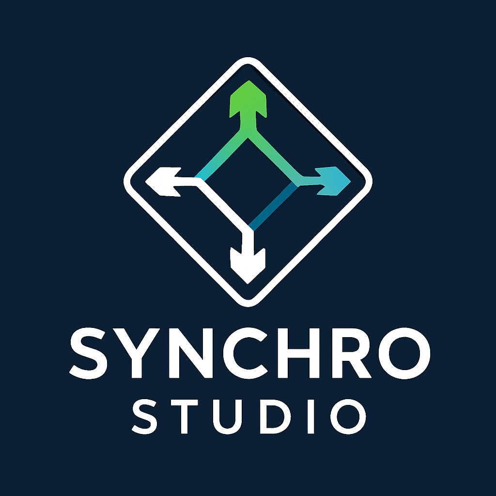
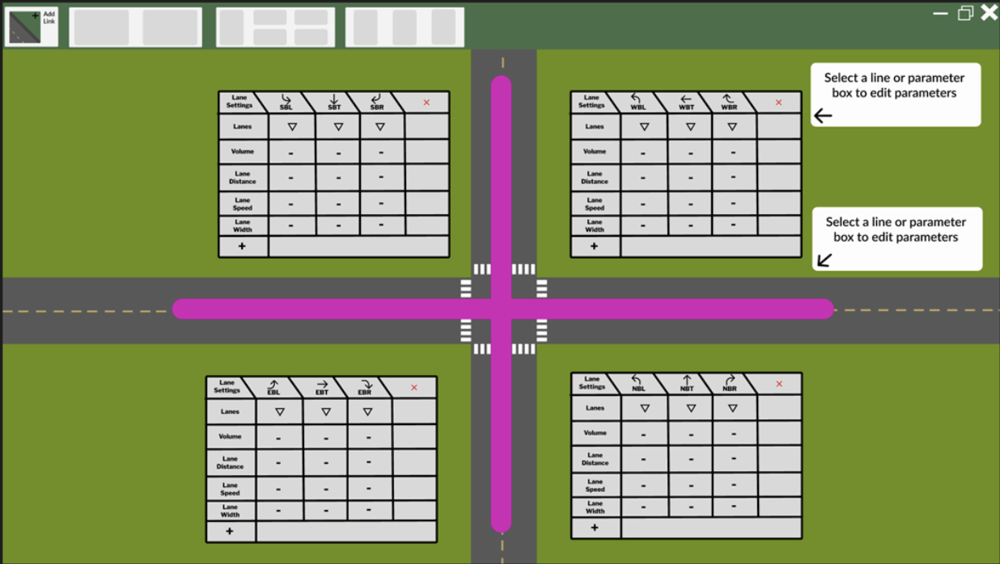
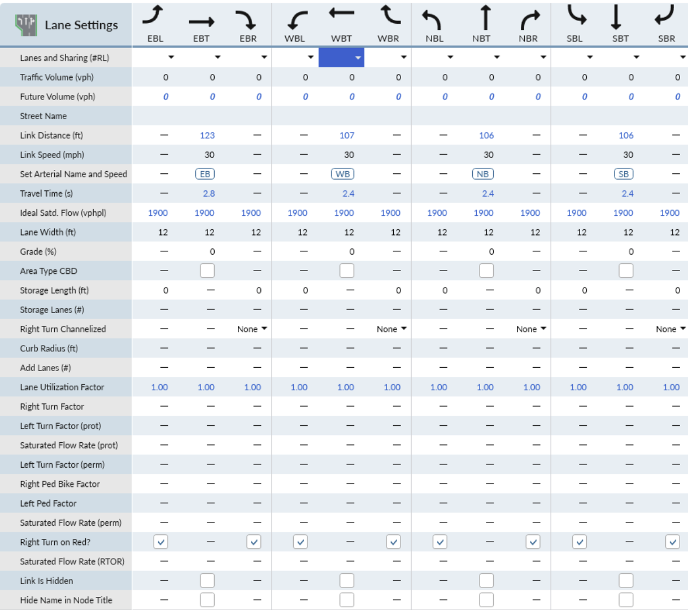
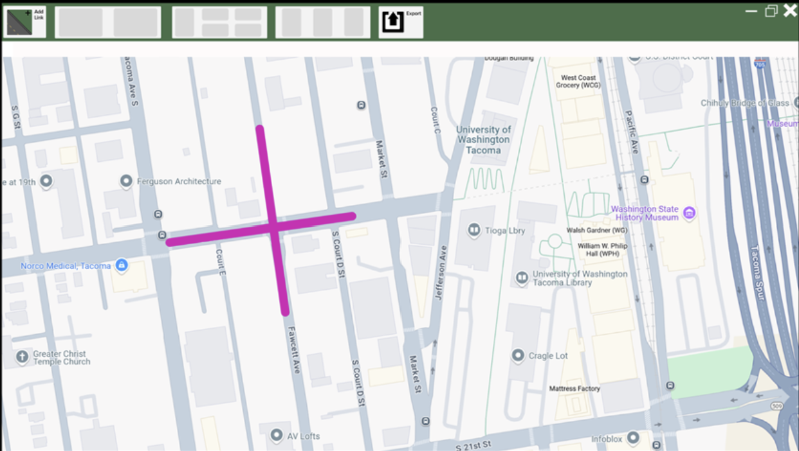

# Synchro Simplified
Enhancing Clarity for Future Traffic Engineers

**Team: TCSS452-AreYouSure?**
- Anthony Petrov
- Jennifer Huynh
- Jeremiah Brenio
- Liam Barragan
- Luke Chung

## Problem and Design Overview
  Synchro Studio, a transportation and traffic network application created by Cubic, has a steep learning curve and its current user interface (UI) challenges aspiring Civil Engineering students and users alike.
  
  This project attempts to address the initial friction of using Synchro as a beginner. From User Research, the most prominent issue arising from interacting with the software, as a new user, was the overload of different buttons, options, and settings within the interface.
  
  The new design laid out encapsulate the two most common tasks that users must perform within the software on a day-to-day basis:
  
### Adding Links and Lane data

#### The proposed redesign 

#### The current design

  
  

  Ultimately, these changes aim to alleviate the decision fatigue from too much "clutter" within the current iteration of the software, while streamlining the process of getting to the "meat" of the workflow.

[Brief overview of your design and approach to solving the problem]

 <!-- Your logo or initial prototype photo -->

## Design Walkthrough

### 1: Completing Intersections with Traffic Data for Analysis

**Task Context:** [What this task is and why it matters]
Adding data to roads & intersections is essential for analysis and simulation. For any given intersection, a user needs to navigate to more than one menu to complete their goal.

This introduces navigation challenges to new users of Synchro, and it doesn't help that multiple of the same settings can be found in different menus, lacking distinction.

[Narrative walkthrough for Task 1 - provide enough detail for an outside reader to understand the design]
This holistic design 

### 2: Importing Map Data into Synchro

**Task Context:** [What this task is and why it matters]
Old experienced users of Synchro had to import map data from third-party services such as Google maps in order to scale their roads correctly onto the UI. The new version of Synchro tries to fix this by integrating Bing maps into Synchro. But we wanted to keep the familiarity and routine for new and old users by adding overlays and further integration with other third-party services.

[Narrative walkthrough for Task 2 - provide enough detail for an outside reader to understand the design]

## Design Research and Key Insights

### Goals
Through our design research and collaboration with the TCE 327 Civil Engineering students, we aimed to gain insight and identify usability challenges using Synchro Studio.

### Methods and Rationale
For our design research methods, we intended to use **contextual inquiry** and conduct **focus groups**. We thought this was the most effective way of obtaining data for the project. **Contextual inquiry** involves observing and asking questions to users in their actual work environment to understand their workflows and challenges. **Focus groups** gather a small group (2 - 5) of participants to discuss their experiences and opinions, providing diverse perspectives and uncovering common issues.

But we’ve encountered **two** main challenges and had to adapt. 

**First**, the class structure consisted of the students following a walkthrough with an industry lecturer. This made it difficult to inquire and ask questions without disturbing the lecture, so we had to pivot to **Fly-on-the-wall** observations, where we observe the whole class without interruption and note emerging themes.

**Second**, we had difficulties with scheduling with the TCE students and getting more than one participant for a given day for our focus group. So we had to switch to **interviews** instead, which set us behind a few weeks for the project. 

But despite that, we were still able to obtain valuable data and insight.

### Key Insights

#### **[Insight 1 Title/Statement]**
- **How it emerged:** [From users, critique, testing, etc.]
- **Evidence:** [Visuals, evidence, or stories]
- **Design influence:** [How this influenced your final design]

#### **[Insight 2 Title/Statement]**
- **How it emerged:** [From users, critique, testing, etc.]
- **Evidence:** [Visuals, evidence, or stories]
- **Design influence:** [How this influenced your final design]

#### **[Insight 3 Title/Statement]**
- **How it emerged:** [From users, critique, testing, etc.]
- **Evidence:** [Visuals, evidence, or stories]
- **Design influence:** [How this influenced your final design]

## Iterative Design and Key Insights

### Design Process Summary
- **Paper Prototyping → Usability Testing**
- **Digital Mockups → Heuristic Testing**
- **Rationale/Reflections:** [What this process revealed]

### Design Insights from Iteration

#### **[Design Insight 1]**
- **How it emerged:** [Description of emergence]
- **Evidence:** [Quotes, observations, or images]
- **Design changes:** [Before/after changes]

#### **[Design Insight 2]**
- **How it emerged:** [Description of emergence]
- **Evidence:** [Quotes, observations, or images]
- **Design changes:** [Before/after changes]

#### **[Design Insight 3]**
- **How it emerged:** [Description of emergence]
- **Evidence:** [Quotes, observations, or images]
- **Design changes:** [Before/after changes]

## Technical and Soft Skills Gained

### Technical Skills
- Figma
- Usability Testing
- Mockup Tools

### Soft Skills
- Collaboration
- Feedback Integration
- Time Management

