<h1 align="center">Synchro Simplified</h1>

  
   
  <i>Enhancing Clarity for Future Traffic Engineers</i>

---

**TCSS 452 Team: Are You Sure?**  
Anthony Petrov • Jennifer Huynh • Jeremiah Brenio • Liam Barragan • Luke Chung

---

## Problem and Design Overview
  Synchro Studio, a transportation and traffic network application developed by Cubic, presents a steep learning curve in its current user interface (UI), challenging aspiring Civil Engineering students and users alike.
  
  This project attempts to address the initial friction of using Synchro as a beginner. From user research, the most prominent issue arising from interacting with the software, as a new user, was the overload of different buttons, options, and settings within the interface.
  
  The new design laid out encapsulates the two most common tasks that users must perform within the software on a day-to-day basis:

### The Proposed Redesign 
  
*Figure 1: Redesigned interface for adding links and lane data, highlighting simplified controls and improved layout.*

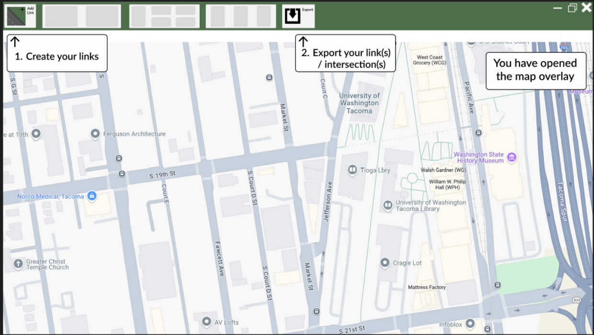  
*Figure 2: Enhanced map data import workflow, showing integration with third-party services for better usability.*

### Our Approach
Ultimately, these changes are designed to reduce decision fatigue caused by excessive interface clutter in the current software. By streamlining navigation and focusing on core workflows, our redesign helps users quickly access essential features and complete tasks more efficiently.

## Design Walkthrough

### 1: Completing Intersections with Traffic Data for Analysis

**Task Context:**
Adding data to roads & intersections is essential for analysis and simulation. For any given intersection, a user needs to navigate to more than one menu to complete their goal.

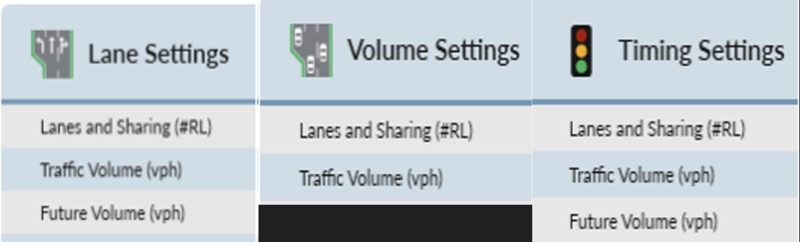

This introduces navigation challenges to new users of Synchro, and it doesn't help that multiple of the same settings can be found in different menus, lacking distinction.
### Redesign Walkthrough

When an intersection is created, a button appears at the center. Clicking this button opens menus for each road, allowing users to access relevant settings directly.

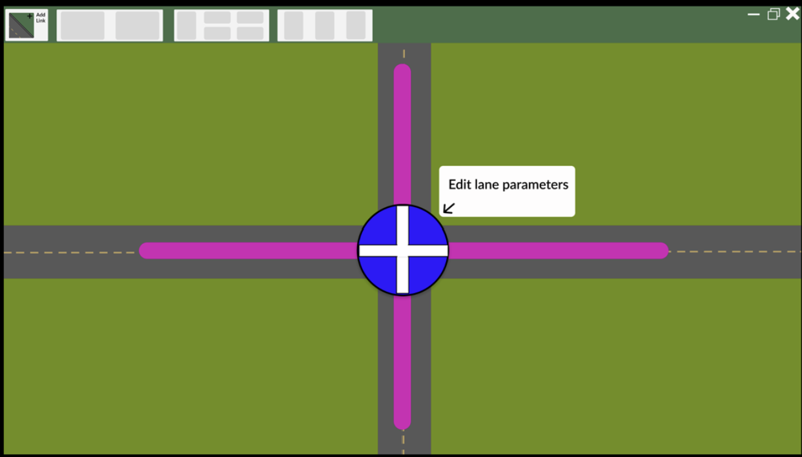

Each menu pops up as an overlay, reducing the need to navigate through multiple menus and making it easier to focus on the current task.

Users can add new row settings for all menus using the plus icon at the bottom-left, streamlining the process of entering and editing data.

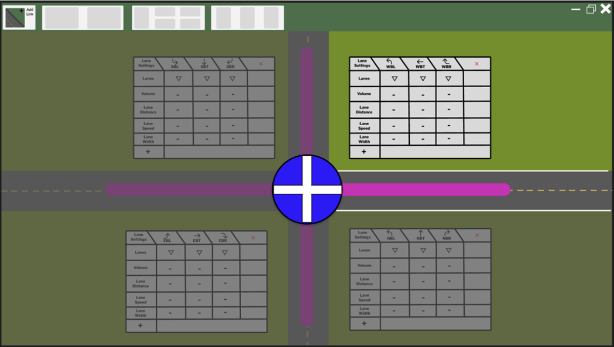

This holistic design aims to mitigate navigation issues by incorporating contextual popups for each road, helping users work more efficiently and with less confusion.

### 2: Importing Map Data into Synchro

**Task Context:**
Previously experienced users of Synchro had to import map data from third-party services such as Google Maps in order to scale their roads correctly onto the UI. The new version of Synchro tries to fix this by integrating Bing Maps into Synchro. But we wanted to keep the familiarity and routine for new and old users by adding overlays and further integration with other third-party services.
### Redesign Walkthrough

The redesigned workflow for importing map data into Synchro focuses on clarity, integration, and ease of use for both new and experienced users.

We use an import button (directly in the top middle of the interface) for the user to begin the import process.
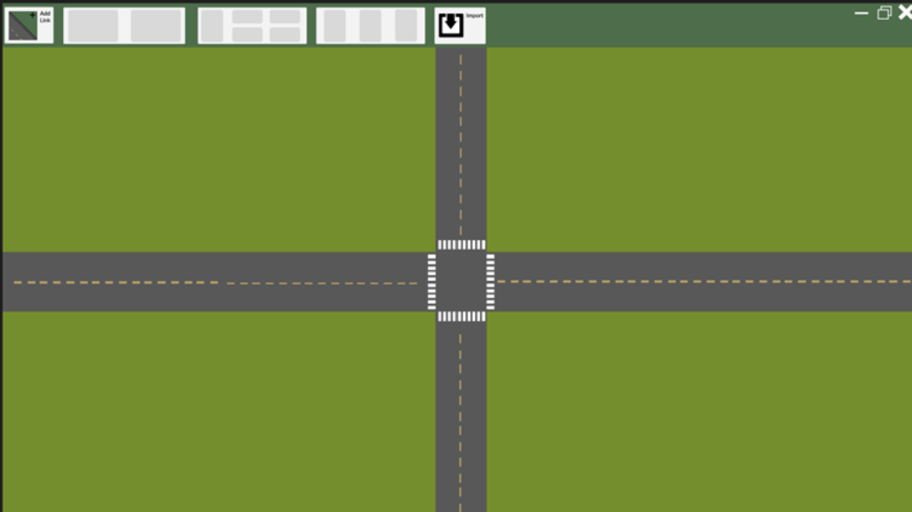

The import screen presents clear options for importing map data, reducing confusion and guiding users toward the most common actions.

Next, users can select from integrated third-party services, such as Google Maps or Bing Maps, to import their desired map data:

This integration maintains familiarity for experienced users while offering streamlined access for newcomers.

The user can then add roads (top left button) on the map overlay, which would then be transferred to Synchro after finalizing their links.

  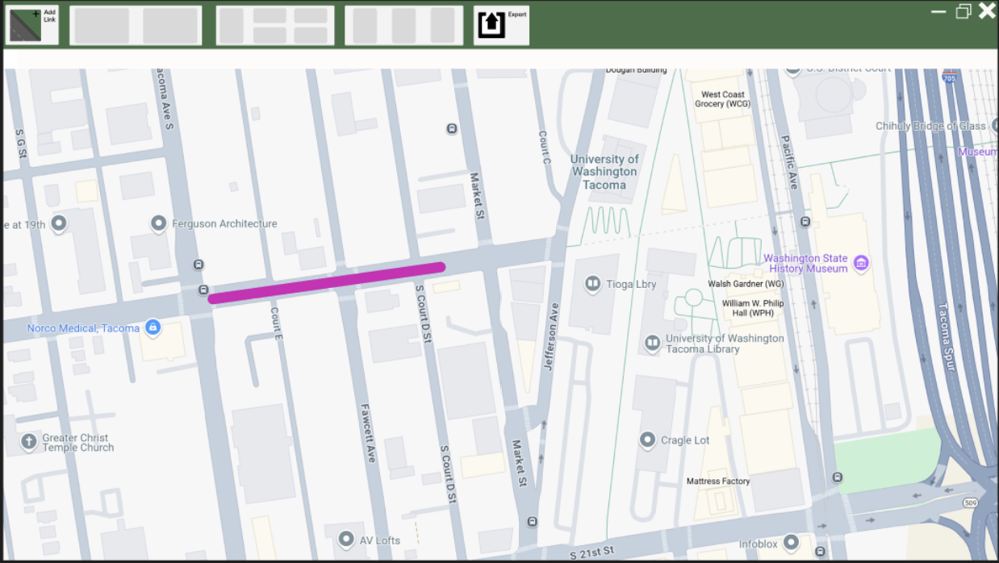
  

 

Once satisfied, users can confirm their selections and complete the import process:

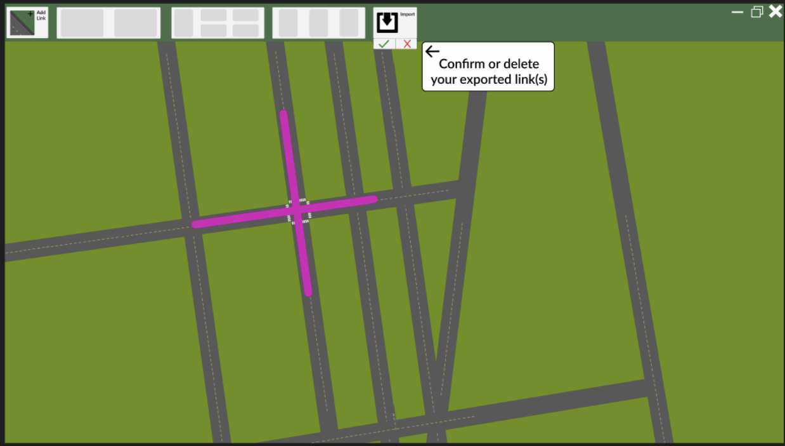

This redesign addresses the previous challenges of fragmented workflows and providing visual guidance throughout the process. The result is a more approachable, efficient, and user-friendly experience that accommodates the needs of both novice and experienced Synchro users.

## Design Research and Key Insights

### Goals
Through our design research and collaboration with the TCE 327 Civil Engineering students, we aimed to gain insight and identify usability challenges using Synchro Studio.

### Methods and Rationale
For our design research methods, we intended to use **contextual inquiry** and conduct **focus groups**. We thought this was the most effective way of obtaining data for the project. **Contextual inquiry** involves observing and asking questions to users in their actual work environment to understand their workflows and challenges. **Focus groups** gather a small group (2 - 5) of participants to discuss their experiences and opinions, providing diverse perspectives and uncovering common issues.

But we’ve encountered **two** main challenges and had to adapt. 

**First**, the class structure consisted of the students following a walkthrough with an industry lecturer. This made it difficult to inquire and ask questions without disturbing the lecture, so we had to pivot to **Fly-on-the-wall** observations, where we observe the whole class without interruption and note emerging themes.

**Second**, we had difficulties with scheduling with the TCE students and getting more than one participant for a given day for our focus group. So we had to switch to **interviews** instead, which set us behind a few weeks for the project. 

But despite that, we were still able to obtain valuable data and insight.

### Key Insights

#### **Overwhelming UI & Infromation Overload for New Users**
- **How it emerged:** Became very clear during our fly-on-the-wall observations, where we saw students struggle with the cluttered interface "Lecturer had a mouse slip/mode slip trying to access the intersection node settings". Students also could not recall basics steps from previous class sessions. Further showing the steep learning curve which comes with Synchro
- **Evidence:** Synchro top ribbon had countless icons, along with dense setting widows and excel style forms with confusing abbreviations such as "EBL". "Changing street names Cluster of options in lane settings made it hard to find the option"
- **Design influence:** This insight became our primary focus for our redesign. It further supported our core goal of simplifying the UI and led to our proposal of consolidating various settings windows into one panel. The default settings would simplify all the settings to just the necessary features and reduce clutter for a beginner without sacrificing the familiarity of the advanced user with the advanced options.

#### **Disconnected Workflows from User's understanding**
- **How it emerged:** During observation we saw that to preform a single task such as defining a intersection users had to access multiple disconnected windows (Lane, Volume, Timing). There was the use of "hack fixes" to fix this issue such as using a dummy node to merge lanes. Highlighting that Synchro does not have a streamlined option leading users to use such "hacks".
- **Evidence:** A student asked, "Why is the receiving lane not being adjusted when we change the incoming lane?" Further highlighting an expecation that Synchro doesnt not understand basic logical road connections. The Lecturer confirmed that Synchro does not do this automatically and suggested adding a pop-up suggestion as a potential fix. "can either give a popup option to update other lanes when changing lane types, or revert to manual changing Important"
- **Design influence:** This played a key part in our final design of the intersection settings panel, in which we kept all related settings in a single context. It also inspired for an option to automatically pushes changes through connected intersections for incoming and outgoing lanes.

#### **Poor Grouping Hides Essential Functions**
- **How it emerged:** During one of our observations, we saw students have a "eureka" moment when they discovered that a critical "move" tool was hidden in a right-click context menu. Aswell as the "Scenario Manager," being an essential feature for managment of simulations, was a small, low-opacity tab on the side of the screen. Making it very difficult to spot.
- **Evidence:** Synchro has a search bar which new users assumed was a global tool search bar but it was only used for searching map addresses, which was not indicated or labled anywhere on the UI. Leading the constant confusion and frustration.
- **Design influence:** This insight led to our proposal to add a global search feature which would allow users to find tools quickly. Making tools easy to find and not hidden behind obscure menus or hard to spot UI elements.

## Iterative Design and Key Insights

### Design Process Summary
- **Paper Prototyping → Usability Testing**
When we started working on paper prototype, we tried our best to focus on simplifying the lane parameters and making it easy for the user to be able to not feel overwhelmed with the parameters. We also kept in mind that we were also trying to make adding lanes easier and simpler for the users. Also, during the making of our paper prototype we tried making the icons drawings as distinguishable as we could so the user did not need to question what certain icons did. During our usability testing, we found that the participants found it difficult to know what certain buttons did and they thought adding a description should be necessary so that things would not be confusing. We did find that the participants did find making intersections easier, however, adding lanes button was not clear to the particpant. We also found that the participants were having a hard time when lane parameter menu was selected.
- **Digital Mockups → Heuristic Testing**
From our iterated paper prototype, we moved into creating digital mockups in Figma. At the time of heuristic testing, only one digital prototype was available—focused on the redesigned process for creating lanes and intersections, as well as adjusting lane parameters. This round of testing revealed several usability issues:
  It was unclear how to add a lane
  Users wanted more flexibility in selecting entire roads, not just intersections
  The purpose of the middle button was ambiguous
  There was a desire to view all lane parameters at once
- **Rationale/Reflections:** 
What this process revealed is that it is not easy to design a product, as users could find it difficult to know what certain things do. Where we thought the user would have an easier time doing a certain task, it was actually difficult for them to do. This type of feedback helped us fix our designs so that users have an easier time doing tasks. This iterative process also revealed that users like simplicity, descriptions to help understand what certain buttons do, and also visual clarity. These types of feedback helped us make our final design easier to use. 

### Paper Prototype
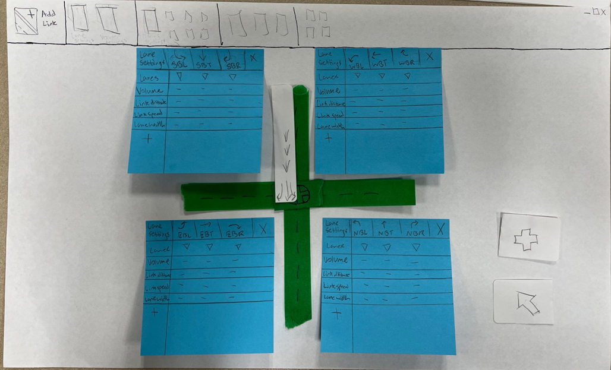
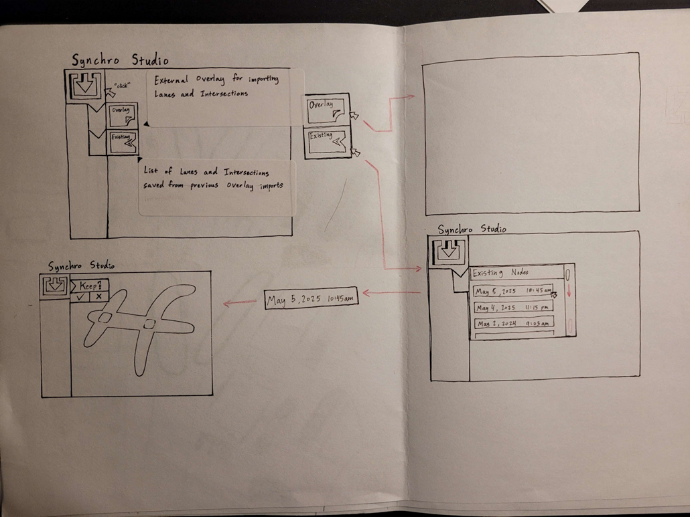
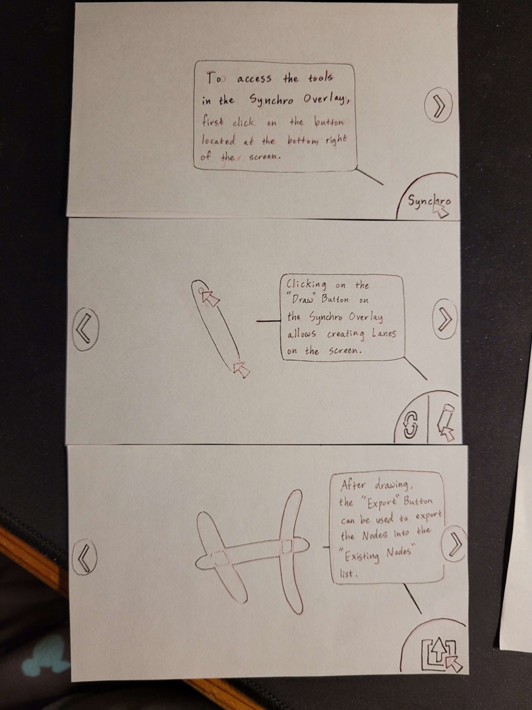

### Design Insights from Iteration

#### **Adding Lane Button Clarity**
- **How it emerged:** One of the groups reviewed our Digital Prototype using the Heuristic Evaulation and found it difficult to identify
the add lane button.
- **Evidence:** The group typed up, "Adding actual lanes is slightly unclear due
to language used (i.e basic symbols).
Because the lane adding was unclear, the
exit button was also a little unclear."
- **Design changes:** 
Before: 
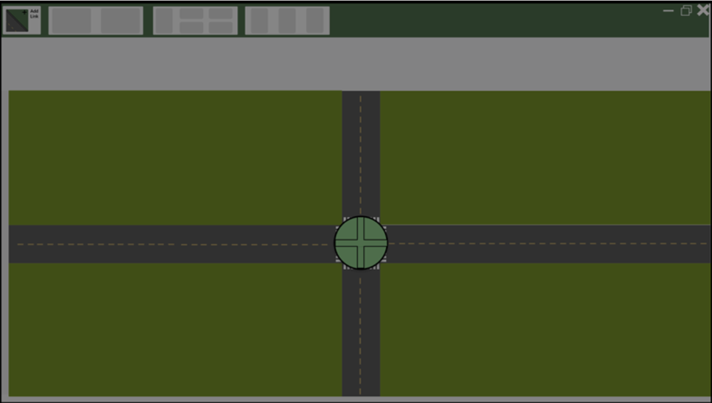
After: 

#### **Making Each Road Selectable**
- **How it emerged:** Heuristic Evaluation from the group evulation had a hard time trying to have the individual roads be selected. 
- **Evidence:** The group said, "The selection is based around
intersections, so if I am working on a road
I have to find the nearest intersection in
order to select the road. This makes
knowing when roads are able to be
selected confusing."
- **Design changes:** 
Before:
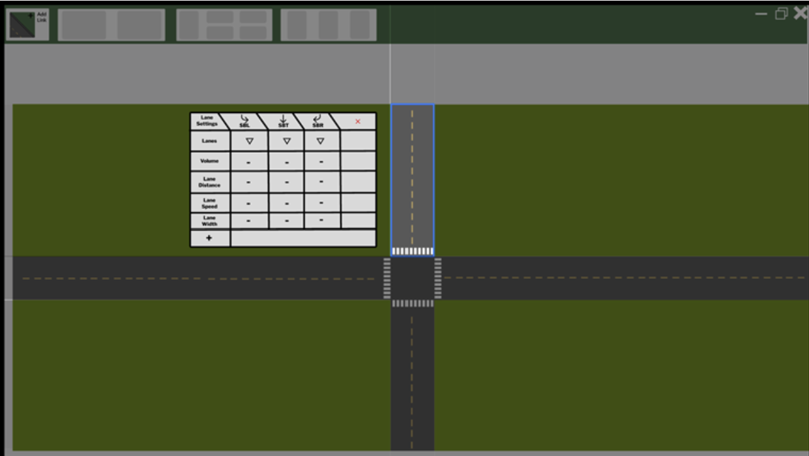
After:

#### **Add Description For Buttons**
- **How it emerged:** During our usability testing for our Paper Prototype, the participants had difficulty figuring out what certain buttons did.
- **Evidence:** From our observations during our usability testing, the participant mentioned they couldn't understand what the button does as there was not description.
- **Design changes:** 
Before:

After:

## Technical and Soft Skills Gained

### Technical Skills
- Design Principles
  - Learnability
  - Efficiency
  - Safety
- Low-Fidelity Prototyping
  - Rapid prototyping
  - Design sketches
  - Paper prototypes
- High-Fidelity Prototyping
  - Figma
  - Digital mockups
- Evaluation Methods
  - Usability testing
  - Heuristic evaluating

### Soft Skills
- Team Collaboration
  - Cross-functional coordination
  - Task delegation
  - Conflict resolution
  - Remote collaboration
- Communication
  - Active listening
  - Presenting concepts
  - Technical documentation
  - Facilitating discussions
- Feedback Integration
  - Processing criticism
  - Peer review incorporation
- Adaptability
  - Method pivoting
  - Schedule adjustments
- Time Management
  - Deadline coordination
  - Priority setting
  - Milestone tracking
- Research Skills
  - User interviewing
  - Pattern identification
  - Insight translation

